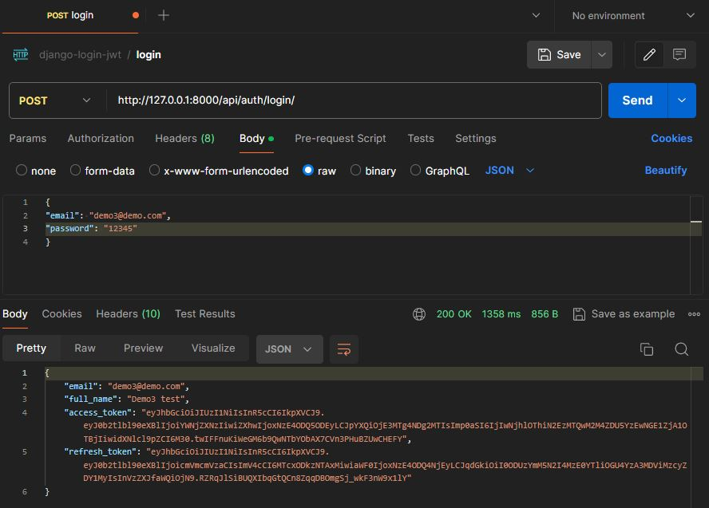
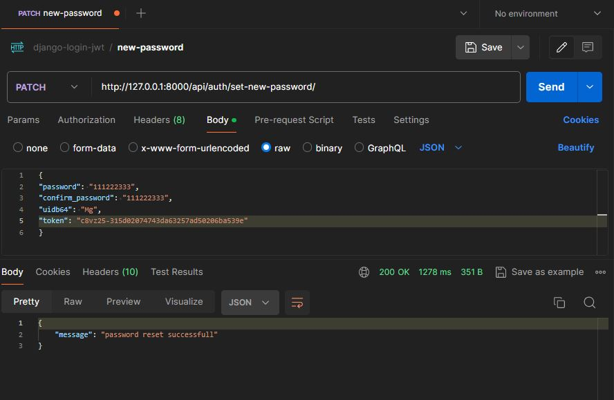

# 💻 LoginEase 💻

This project implements a RESTful API using Django and JSON Web Tokens (JWT) for authentication. Users can register, log in, reset their password, and obtain a JWT token that allows them to access protected API resources.

## Technologies

For testing, [Mailtrap email](https://mailtrap.io/) has been used.
Make sure you configure Mailtrap in your development environment. Here is an example of configuration in the .env file:

```python
EMAIL_HOST=sandbox.smtp.mailtrap.io
EMAIL_HOST_USER=your_mailtrap_username
EMAIL_HOST_PASSWORD=your_mailtrap_password
EMAIL_PORT=2525
EMAIL_USE_TLS=True
DEFAULT_FROM_EMAIL=your_default_from_email@example.com
```

[](https://skillicons.dev)

[](https://choosealicense.com/licenses/mit/)
[](https://github.com/EmanuelCG/django-login-JWT "Go to GitHub repo")

## Screenshots

### Register user


### Validation code


## Verify account


## Login



## Reset password




## Installation

1. Clone the repository:

    ```bash
    git clone https://github.com/EmanuelCG/musical-gear-api.git
    ```

2. Navigate to the project directory:

    ```bash
    cd your_project
    ```

3. Install the dependencies:

    ```bash
    pip install -r requirements.txt
    ```

## Usage

1. Set up your virtual environment and activate it.
2. Run the development server:

    ```bash
    python manage.py runserver
    ```

3. Open your web browser and visit `http://localhost:8000` to see the application in action.

## Contribution

If you want to contribute to this project, follow these steps:

1. Fork the project.
2. Create a new branch (`git checkout -b feature/new-feature`).
3. Make your changes and commit them (`git commit -am 'Add a new feature'`).
4. Push to the branch (`git push origin feature/new-feature`).
5. Create a pull request.
